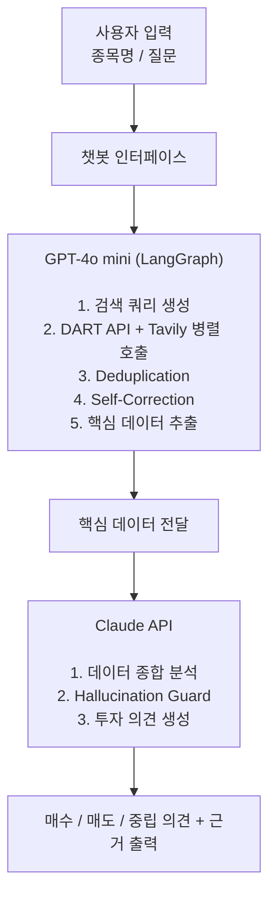

# stock-agent-kr

> **DART 공시와 최신 뉴스를 기반으로 국내 주식 매수/매도를 분석하는 AI 챗봇**


`stock-agent-kr`은 한국 주식 시장을 대상으로  
**DART 전자공시 데이터 + 최신 뉴스**를 수집하여  
특정 종목에 대한 **투자 판단 인사이트**를 제공하는 AI 챗봇입니다.

사용자가 종목명 또는 종목코드를 입력하면 AI가 관련 공시와 뉴스를 분석하여 **매수 / 매도 / 중립 의견과 근거**를 자연어로 제공합니다.

⚠️ **본 프로젝트는 투자 참고용이며 실제 투자 판단은 사용자 본인의 책임입니다.**

---

## 목차

- [프로젝트 구조](#프로젝트-구조)
- [개발환경](#개발환경)
- [기술 스택](#기술-스택)
- [주요 기능](#주요-기능)
- [프로젝트 아키텍처](#프로젝트-아키텍처)
- [데이터 처리 흐름](#데이터-처리-흐름)
- [시작하기](#시작하기)
- [기술적 도전 과제](#기술적-도전-과제)
- [향후 개선 계획](#향후-개선-계획)
- [라이선스](#라이선스)

---

# 프로젝트 구조

```text
stock-agent-kr
│
├── main.py
├── agents
├── tools
│   ├── dart_api.py
│   └── news_search.py
├── workflows
│   └── langgraph_workflow.py
└── evaluation
    └── ragas_eval.py
```

---

# 개발환경

| 항목 | 버전 |
|---|---|
| Python | >=3.11 |
| 패키지 관리 | uv |
| OS | Windows / macOS / Linux |

---

# 기술 스택

| 분류 | 기술 |
|---|---|
| LLM (데이터 처리) | GPT-4o mini |
| LLM (최종 분석) | Claude API |
| Workflow | LangGraph |
| RAG | LangChain |
| 공시 데이터 | DART OpenAPI |
| 뉴스 검색 | Tavily |
| 평가 | Ragas |
| 언어 | Python |

---

# 주요 기능

### 📊 DART 공시 분석
- XML / JSON 기반 단일공시 및 정기공시 분석

### 📰 뉴스 기반 시장 시그널 분석
- Tavily 검색을 활용한 최신 뉴스 수집
- 종목 관련 **긍정 / 부정 시그널 파악**

### 🔁 Self-Corrective 검색
- 검색 결과가 질문과 관련 없으면
- 검색 쿼리를 자동 재구성 후 재검색

### 🧹 Deduplication
- 동일 공시 및 동일 뉴스 자동 제거
- LLM 컨텍스트 품질 유지

### 🛡 Hallucination Guard
- 생성된 근거를 실제 **DART 원문과 대조**
- 불일치 시 자동 재생성

### 💬 자연어 챗봇 인터페이스
- 종목명 기반 질문
- AI가 투자 판단 근거와 함께 자연어 답변

---

# 프로젝트 아키텍처



---

# 데이터 처리 흐름

1️⃣ 사용자 질문 입력  

2️⃣ GPT-4o mini가 **검색 쿼리 생성**

3️⃣ 데이터 수집
- DART 공시
- 뉴스 검색

4️⃣ 데이터 정제
- Deduplication
- Self-Correction

5️⃣ 핵심 데이터 추출

6️⃣ Claude가 종합 분석 수행

7️⃣ 투자 의견 생성
- 매수
- 매도
- 중립

---

# 시작하기

### 1️⃣ 저장소 클론

```bash
git clone https://github.com/your-username/stock-agent-kr.git
cd stock-agent-kr
```

### 2️⃣ 패키지 설치

```bash
uv sync
```

### 3️⃣ 환경 변수 설정

프로젝트 루트에 `.env` 파일 생성

```env
DART_API_KEY=your_dart_api_key
OPENAI_API_KEY=your_openai_api_key
ANTHROPIC_API_KEY=your_anthropic_api_key
TAVILY_API_KEY=your_tavily_api_key
```

| 환경변수 | 발급처 |
|---|---|
| DART_API_KEY | https://opendart.fss.or.kr |
| OPENAI_API_KEY | https://platform.openai.com |
| ANTHROPIC_API_KEY | https://console.anthropic.com |
| TAVILY_API_KEY | https://tavily.com |

---

### 4️⃣ 실행

```bash
uv run main.py
```

---

# 기술적 도전 과제

### DART 데이터 수집 전략

DART OpenAPI에서 제공하는
**XML / JSON 공시 데이터를 데이터 소스**로 활용합니다.

수집된 재무제표 데이터는 LLM이 이해하기 쉬운 **Markdown 형태**로 변환합니다.

---

### 중복 데이터 제거 (Deduplication)

DART와 뉴스 데이터를 병렬 수집하는 과정에서  
동일 공시 또는 동일 뉴스가 중복 유입될 수 있습니다.

다음 기준으로 자동 제거합니다.

- 공시 번호
- 뉴스 URL

---

### 데이터 신뢰성 확보

뉴스 데이터의 노이즈를 줄이기 위해

- Tavily Search Depth 최적화
- 공시 데이터 우선 정책 적용

즉,

```
공시 > 뉴스
```

우선순위로 분석됩니다.

---

### Self-Corrective Workflow

검색 결과가 질문과 관련 없으면

1️⃣ 관련도 평가  
2️⃣ 검색 쿼리 재구성  
3️⃣ 재검색 수행

LangGraph의 **조건부 Edge**를 활용하여 구현했습니다.

---

### Hallucination Guard

LLM이 생성한 투자 근거가

- 실제 DART 데이터와 일치하는지
- 원문과 의미가 같은지

검증합니다.

검증 실패 시 **자동 재생성**합니다.

---

# 향후 개선 계획

- PDF 공시 파싱 지원 (PyMuPDF 기반, API 미지원 문서 대응)
- 실시간 주가 데이터 연동
- 멀티 종목 비교 분석
- 포트폴리오 추천
- 백테스트 기능

---

# 라이선스

MIT License